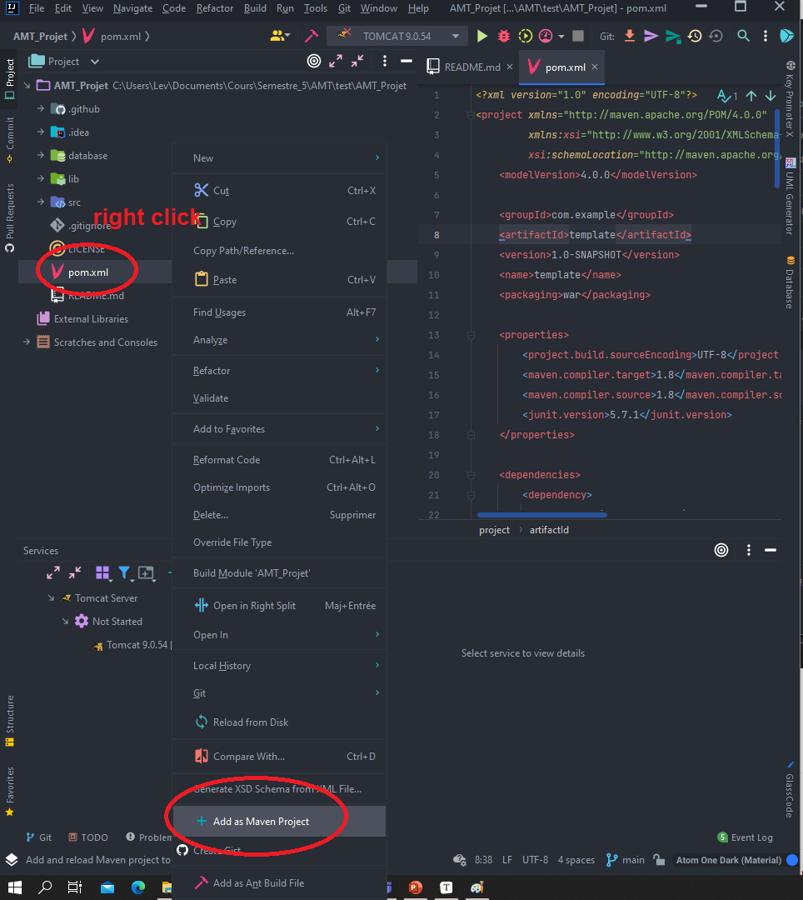
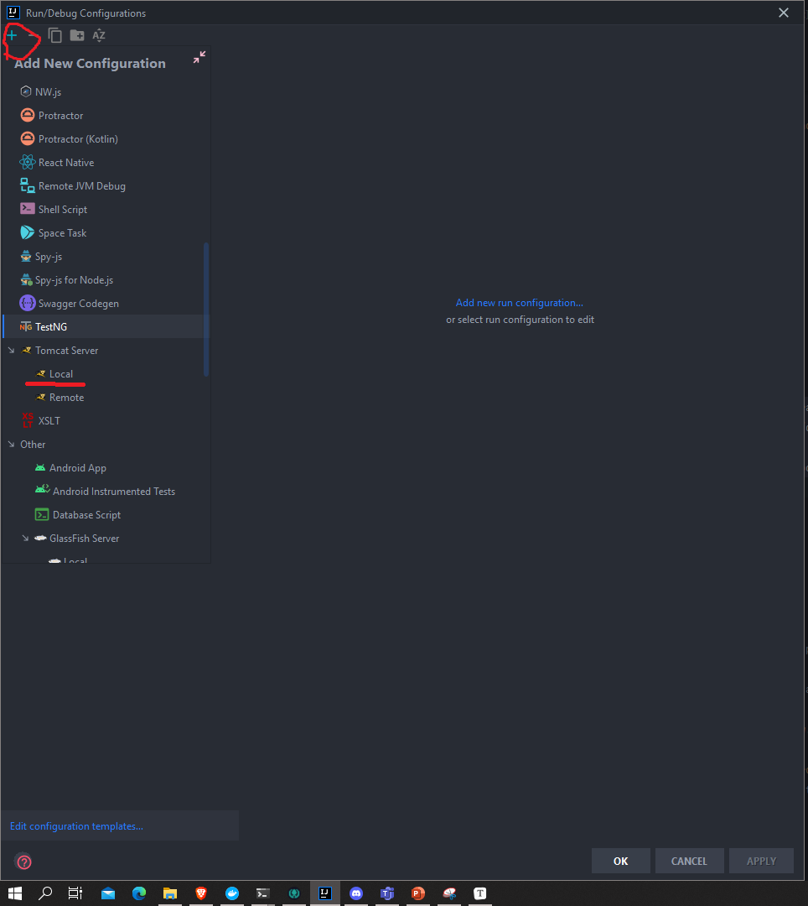
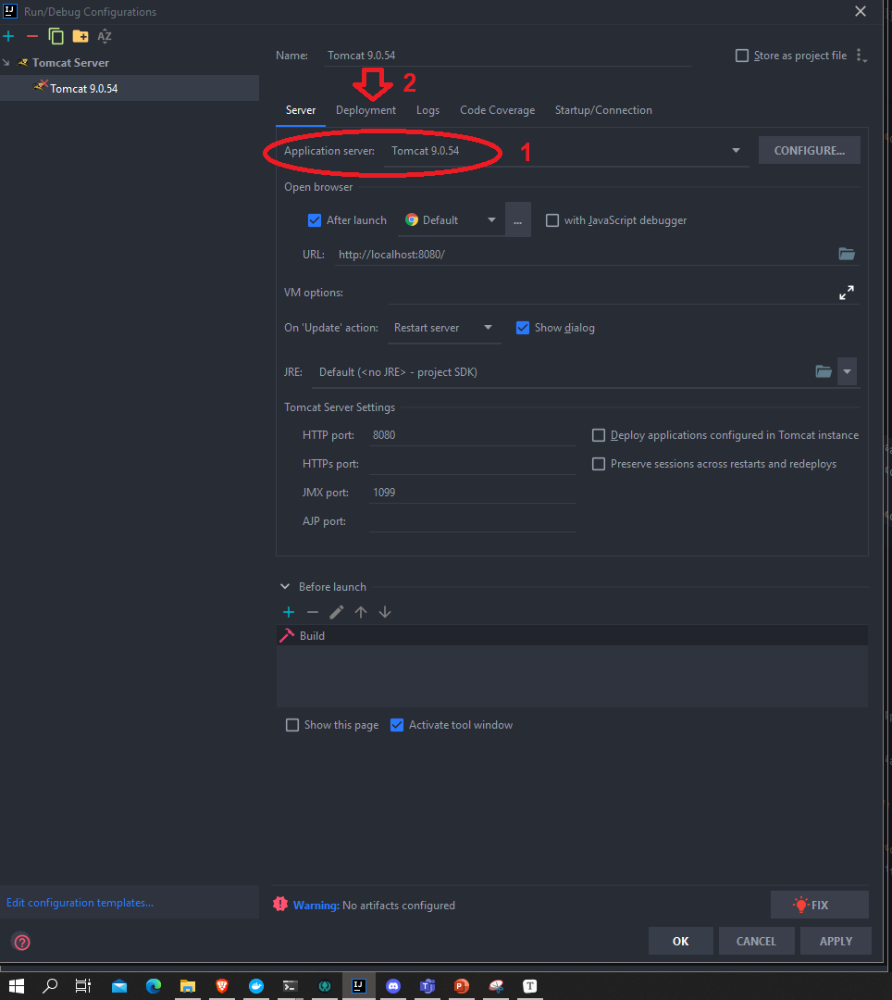
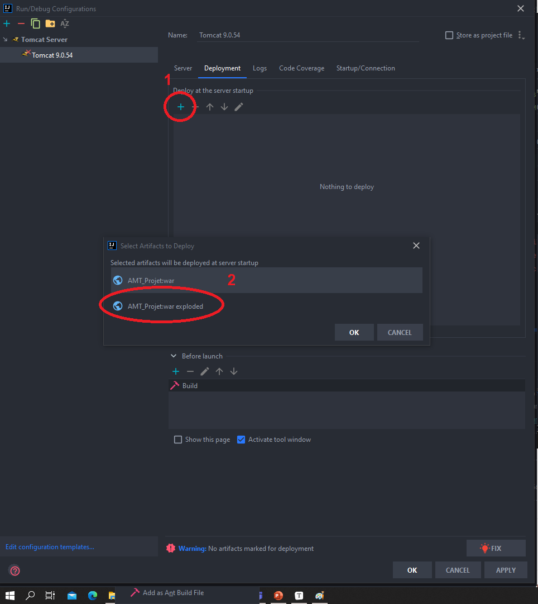

    

# AMT_Projet

## Table of content

- [Installation](#installation)
- [Usage](#usage)
- [Contributing](#contributing)
- [License](#license)

## Installation

Project is developped using [IntelliJ](https://www.jetbrains.com/fr-fr/idea/) IDE.
The server is [Tomcat 9.0.54](https://tomcat.apache.org/download-90.cgi)

To start developping, clone the repo. Open the repo using IntelliJ. You then need to define the configuration

### Using intelliJ and Tomcat

- Import as maven project:

And execute ``mvn clean install``

- Create a new configuration

- (1) : You will have to give here the path to Tomcat binary.

  (2): Then go to deployement

- Add the artifact. If the IDE does not propose it, it is available in the target directory generated by the ``mvn clean install``in the project

- Click apply and ok.

### Docker and database

We are using a MySQL Database in a docker container.

- First install [Docker desktop](https://www.docker.com/products/docker-desktop)
- Then go in the project directory then to database folder
- Run ``script.sh`` , this will run build the docker image and run the container

You can now start coding, gl hf ! 

## Usage

Well, if you did the installation right, you can click on the run button.

## Contributing

Pull requests are more than welcome. For major changes, please open an issue first to discuss what you would like to change.

Pull requests whitch do not pass unit tests will not be accepted. If you feel that the current tests are not wide enough to cover your implementation, feel free to add yours. Make them as explicit as possible and to respect the [naming convention](https://github.com/Semestre5/AMT_Projet/wiki/Naming-convention)

The project is developped on [IntelliJ IDEA](https://www.jetbrains.com/idea/). To start developping:

- Go to [dev branch](https://github.com/Semestre5/AMT_Projet/blob/dev/README.md) and clone it.
- Initialize the git flow with the procedure defined in the wiki (project rules, [this section](https://github.com/Semestre5/AMT_Projet/wiki/Project-rules#how-to-interact-with-the-repository))
- Open IntelliJ and open the repository as a workspace
- Read the project rules in the wiki entirely and start coding (look at the installation procedure before !!!)

## License

[MIT](https://choosealicense.com/licenses/mit/)
