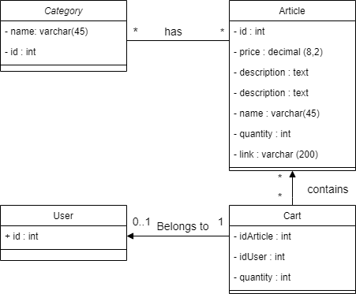

[](https://lgtm.com/projects/g/Semestre5/AMT_Projet/context:java) [](https://github.com/Semestre5/AMT_Projet/issues) [](https://github.com/Semestre5/AMT_Projet)  


# AMT_Projet

## Table of content

- [Infrastructure](#Infrastructure)
- [Check current solution](#Check current solution)
- [UML](#UML)
- [Microservice](#Microservice)
- [Installation](#installation)
- [Usage](#usage)
- [Contributing](#contributing)
- [Go further](#go further)
- [License](#license)

## Infrastructure

How an outside client can communicate with our Web Application


## Check current solution

You can see the current solution working on AWS server. You schould juste take care to start up the docker service, with the command as follow. (service shut off at each shutdown of AWS server) on the tomcat server (10.0.1.20)

```bash
cd database
sudo docker-compose up --build -d
```

And the go to http://localhost:8080/workinprogress 

PS : change port to HTTP mapped port with ssh.

## UML

As the project is based on JEE, we didn't show our differents servlets, because it is mainly used for showing the different models datas. 

> 

## Diagramme de séquence

### Show the Cart


### Update the Cart


## Microservice

[See specifications](microservices/authentification/README.md)

## Installation

Project is developped using [IntelliJ](https://www.jetbrains.com/fr-fr/idea/) IDE.
The server is [Tomcat 9.0.54](https://tomcat.apache.org/download-90.cgi)

### Actual state

This project doesn't allow yet the uses of differents variable as entrypoint, so the current solution is based on deployement environnement shown [above](#Infrastructure), so if you want to use a different path to authentification API, please fix the content below to your own use.

```java
//src/main/java/com/amt/authentication/CheckCredentials.java
public static final String loginPath = "api/auth/login";
public static final String registerPath = "api/accounts/register";
public static final String auth_microservice_server = "http://localhost:8080/";
```

### Using intelliJ and Tomcat

- Import as maven project:


And execute ``mvn clean install``

- Create a new configuration


- (1) : You will have to give here the path to Tomcat binary.

  (2): Then go to deployement


- Add the artifact. If the IDE does not propose it, it is available in the target directory generated by the ``mvn clean install``in the project, 
  the artifact might also be named ``template-1.0-SNAPSHOT.war``, for that you should choose the exploded version aswell. 


- Click apply and ok.

### Docker and database

We are using a MySQL Database in a docker container. This docker image has one instance that keeps 2 databases. One is for the webapp, the other one is for the authentification microservice.

- First install [Docker desktop](https://www.docker.com/products/docker-desktop)
- Then go in the project directory then to database folder
- Run ``script_linux.sh`` , this will run build the docker image and run the container

You can now start contact the databases.

## Usage

Well, if you did the installation right, you can click on the run button. You now have a local version of the website.

## Contributing

Pull requests are more than welcome. For major changes, please open an issue first to discuss what you would like to change.

Pull requests whitch do not pass unit tests will not be accepted. If you feel that the current tests are not wide enough to cover your implementation, feel free to add yours. Make them as explicit as possible and to respect the [naming convention](https://github.com/Semestre5/AMT_Projet/wiki/Naming-convention)

The project is developped on [IntelliJ IDEA](https://www.jetbrains.com/idea/). To start developping:

- Go to [dev branch](https://github.com/Semestre5/AMT_Projet/blob/dev/README.md) and clone it.
- Initialize the git flow with the procedure defined in the wiki (project rules, [this section](https://github.com/Semestre5/AMT_Projet/wiki/Project-rules#how-to-interact-with-the-repository))
- Open IntelliJ and open the repository as a workspace
- Read the project rules in the wiki entirely and start coding (look at the installation procedure before !!!)

## Go further

Implement an exception error catch. It would allow us to print the different possible errors to the client dynamicly.

Another approvement would be the uses of environnement variable to set differents variable parameters of the application, like the IP of microservices, IP of database, different protocols, or even API URLs.

## License

[MIT](https://choosealicense.com/licenses/mit/)
