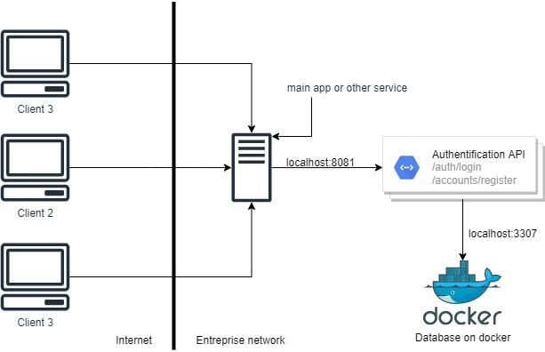

# Authentification micro service - AMT

In the cast of the AMT project in 2022, we had to develop a micro-service that has 2 functionalities, as the login and register service.

## Technologies

- Tomcat 9 as server application. You can use another server if you want. 

- JBoss (RESTEasy JAX RS Implementation)
- JWT. We generate JWT tokens when a client connection is successful, as the client could use this token to identify itself to the different services linked.

## Infrastructure

Basic use of this micro service in your infrastructure.



## Requirement to communicate

#### HTTP Headers

`Accept : application/json`

`Content-Type : application/json`

#### Body

`{ "username" : "SET_USERNAME", "password" : "SET_PASSWORD" }`

#### Response

**Register** 200

**Login**

```json
{
  "token": "string",
  "account": {
    "id": 0,
    "username": "string",
    "role": "string"
  }
}
```

## Installation

We use Tomcat 9 to host the microservice. So this installation procedure is base on that.

1. Download this repository

2. Build the application with 2 different way.

   1.  `mvn clean package` if your want the war (easy way)

   2. `mvn clean package tomcat7:redeploy` if you want to deploy it directory. You need to configure your `pom.xml` and your tomcat server. See the documentation. (hard way)

      ```xml
      <plugin>
          <groupId>org.apache.tomcat.maven</groupId>
          <artifactId>tomcat7-maven-plugin</artifactId>
          <version>2.2</version>
          <configuration>
              <server>localhost</server> # in your tomcat configuration
              <url>http://localhost:8080/manager/text</url> # path to configuration 			# manager
              <path>/API</path> #you can set you own path
          </configuration>
      </plugin>
      ```

   3. You're done, you can test your API. 

### Database

The procedure to setup the mandatory database is the following

```
cd database
docker-compose up --build
```

Note the application use the direct link `localhost:3307` in hibernate configuration at `src/main/resources/hibernate.cfg.xml`

## Go further

This application as 2 main problems that could be fixed :

- We could implement a Exception catch system to return better errors
- We could implement a way to deploy this application with a different set of environment variable, as we don't need to hard code private asynchronous key to sign `JWT` Token.

